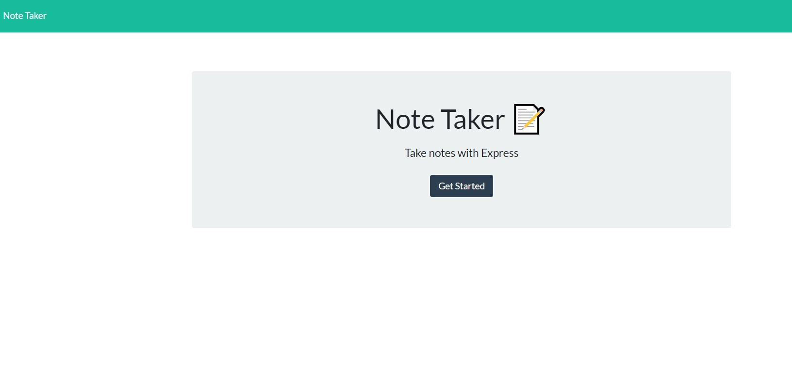
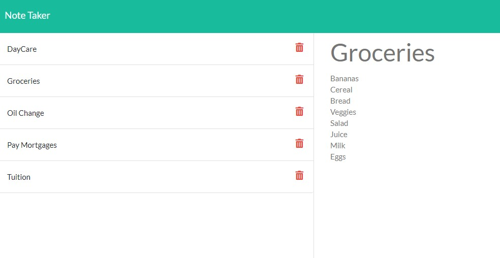

# Note-Taker-FDH
A note taking application has been created for when someone who is interested in capturing their notes.  When an individual clicks the link to the notes page, they are presented with a page with existing notes listed in the left-hand column, plus empty fields to enter a new note title and the note’s text in the right-hand column.  When the user is done, they click on the “Save” icon and the new note is saved and appears in the left-column with the other existing notes. When the user clicks on an existing note, that note appears in the right-hand column. The user can click the “write” icon in the navigation at the top of the page, then they are presented with empty fields to enter a new note title and the note’s text in the right-hand column. The user can also delete a previous note entered by clicking the "trash" icon.

## Table of Contents

- [Installation](#installation)
- [Usage](#usage)
- [Roadmap](#roadmap)
- [Contributions](#contributions)
- [Questions](#questions)

## Installation

github: https://github.com/harrisfd/Note-Taker-FDH

## Usage
Deployed Link: https://notetakerfdh.herokuapp.com/

## Roadmap

Continuous updates to help improve the overall look of the team profile generator.  

## Contributions

No contributions at this time.

## Questions

Please email fharrisfoster@gmail.com for any questions.
